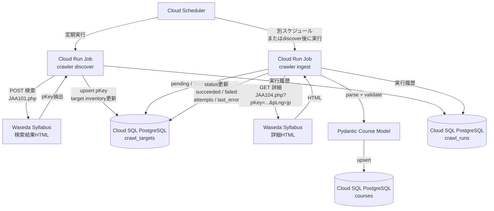

# シラバスCrawlerJob設計

## 概要 (Overview) <!-- REQUIRED -->

### 要約 (Summary) <!-- REQUIRED -->

早稲田大学のシラバスをクローリングし、結果をpostgresにUpsertで格納するシステム起点のジョブの設計を決定する。
http Clientにはhttpx、HTML解析にはBeautifulSoup4 + lxmlを採用する。
実際のジョブ実行ではcrawlerパッケージを実行するDockerfileを作成し、Cloud Run Jobでそのエントリーポイントを叩く。

### 背景 (Background) <!-- REQUIRED -->

今回のシラバス検索システムを構築するための基盤。ジョブ実行を堅牢に設計することが本システムにおいて非常に重要になる。

### 目的 (Purpose) <!-- REQUIRED -->

シラバスシステムに必要なデータをデータ元から完全に抽出し、postgresに格納できることを目的とする。
ジョブの詳細な非機能要件(実行速度など)を厳密に定めて達成することは目的の対象外。

#### ゴール (Goals) <!-- REQUIRED -->

- 生成したJobが正しくデータを格納できる
- 異常系が発生した場合、正しくログをはいて異常終了できる
- 適切なリトライ設計がされている

#### スコープ外 (Out of Scope) <!-- Optional -->

- Jobパフォーマンスの向上。今回は速度は律速ではないのでスコープ対象外

### 前提 (Assumptions) <!-- Optional -->

- 早稲田大学のシラバス検索サイトのトップページURLは https://www.wsl.waseda.jp/syllabus/JAA101.php
- formでキーワード・分野コード・レベル・科目名。教員名・学期・曜日・時限・授業で使用する言語・授業方法区分・オープン科目か否か・学部の条件で検索を行える
- formで指定した条件はクエリパラメータとして付与されない
- 検索結果の件数が膨大な場合ページネーションが行われる
- ページネーションのページ指定番号はクエリパラメータとして付与されない
- APIはかなりレガシー且つ現在のweb・REST APIの原則には則っておらず、formをPOST送信して検索パラメータをbodyに載せて送信している。
- 主に使用するのは以下のパラメータ
    - nendo: シラバスの開講年度を絞り込む
    - page_size: ページネーションのLIMIT指定。最大5000程度で保守的に2000でジョブでは実行する
    - p_page: ページネーションのOFFSET指定。
- 一覧検索ではPOSTだったが詳細取得ではGETメソッドが使用可能。pKey(シラバスの主キー)をパスパラメータとして https://www.wsl.waseda.jp/syllabus/JAA104.php?pKey=2600001002012026260000100226&pLng=jp のような形式で指定する

### 制約 (Constraints) <!-- Optional -->

<!--
スケジュール/人員/技術的な制約や must-have 条件などがあれば記載してください。
-->

### リスクと緩和策 (Risks & Mitigations) <!-- Optional -->

<!--
想定されるリスクがあれば箇条書きで記載してください。
リスクの影響度や検知方法、緩和策もあれば併記してください。
-->

### 未決事項 (Open Questions) <!-- Optional -->

<!--
設計の意思決定に必要な未確定事項を記載する節です。
レビューや議論を通じて解決すべき論点をここに挙げてください。
- 意思決定のオーナーと締切がわかるとベターです。
- Design Docがレビュー完了する前に解決することを想定しています。
- 解決後は「前提」に移動するか、この節から削除してください。
-->

## 非機能要件 (Non-Functional Requirements) <!-- Optional -->

<!--
設計の前提となる非機能要件を記載する章です。
SLO、スケーラビリティ、セキュリティなど、設計判断に影響する非機能要件をここに記載します。
章タイトル直下は空欄でOKです。以下の節に記述してください。
-->

### セキュリティ (Security) <!-- Optional -->

<!--
認証/認可モデルや権限、PIIの扱い、CSRF/XSS/SSRFへの対策などを記載します。
機密情報の保管・管理方針があれば併記してください。
-->

### パフォーマンス (Performance) <!-- Optional -->

<!--
想定トラフィックやSLO、スケーリング方針、負荷対策などを記載します。
-->

### オブザーバビリティ (Observability) <!-- Optional -->

<!--
ログ/メトリクス/トレース/アラートの方針を記載します。
ダッシュボードのURLがあれば併記してください。
-->

### コスト (Cost) <!-- Optional -->

<!--
インフラ費用への影響や見込みを記載します。
コスト抑制の方法があればそれも併記してください。
-->

## 設計 (Proposed Design) <!-- REQUIRED -->

<!--
How: どのように実現するかの章。
章タイトル直下は空欄でOKです。以下の節に記述してください。
-->

### 全体設計 (High-Level Design) <!-- REQUIRED -->

今回は単発のジョブでクローリング・DB Upsertを全て行うのではなく、2回のコマンドで責務(pKey全取得・各pKeyについてGETしてDB Upsert)を分割する。



### 影響範囲 (Impact) <!-- Optional -->

<!--
変更が入るコンポーネント/サービスと依存影響を箇条書きで記載します。
依存しているコンポーネント/サービスに移行の必要があれば併記してください。
-->

### データモデル・データベース設計 (Data Models & Database Design) <!-- Optional -->

```mermaid
erDiagram
    CRAWL_RUNS ||--o{ CRAWL_TARGETS : "last_seen_run_id"
    CRAWL_TARGETS ||--o| COURSES : "p_key"

    CRAWL_RUNS {
        bigint id PK
        text job_type
        text status
        timestamptz started_at
        timestamptz finished_at
        int discovered_count
        int ingested_count
        int failed_count
        text error_message
        timestamptz created_at
        timestamptz updated_at
    }

    CRAWL_TARGETS {
        text p_key PK
        bigint last_seen_run_id FK
        text status
        int attempts
        text last_error
        int discovered_year
        int source_page

        timestamptz first_discovered_at
        timestamptz last_discovered_at
        timestamptz last_ingested_at
        timestamptz created_at
        timestamptz updated_at
    }

    COURSES {
        bigint id PK(p_keyをそのまま格納する)
        text academic_year
        text faculty
        text title
        text instructor
        text term_day_period
        text category
        text eligible_year
        int credits
        text classroom
        text campus
        text course_key
        text class_code
        text language
        text delivery_mode
        text course_code

        text subtitle
        text overview
        text objectives
        text before_after_study
        text lesson_plan
        text textbook
        text reference_text
        text notes

        text raw_html
        text source_url
        text syllabus_updated_at
        timestamptz fetched_at
        timestamptz created_at
        timestamptz updated_at
    }
```


### API設計 (API Design) <!-- Optional -->

<!--
マイクロサービス間やFE-BEのインターフェースの設計を記載してください。
エンドポイント名/メソッド名/主要パラメータ/レスポンス/認証/エラー方針など。
Breaking change があれば併記してください。
-->

### フロントエンド設計 (Frontend Design) <!-- Optional -->

<!--
フロントエンドの設計が必要な場合に記載してください。
Figmaなどの画面遷移図へのリンクがあれば併記してください。
-->

### ビジネスロジック・アルゴリズム (Business Logic & Algorithms) <!-- Optional -->

<!--
複雑なビジネスロジックやアルゴリズムが必要な場合に記載してください。
-->

### {{ トピック名 }} ({{ TopicName }}) <!-- Optional -->

<!--
上記以外で特記したいトピックがあれば追加してください。
「設計」の章の中であれば位置は任意です。
-->

## 検討した代替案 (Alternatives Considered) <!-- Optional -->

<!--
比較・検討した案と採否理由を簡潔に記載してください。
- 案A（採用）: メリット/デメリット/選んだ理由
- 案B（不採用）: 却下理由（例: スケールが困難、コストが高い、など）
-->

## テスト戦略 (Testing Strategy) <!-- Optional -->

<!--
実施するテスト方針、どこまで検証するかを記載する章です。
章タイトル直下は空欄でOKです。以下の節に記述してください。
-->

### 単体テスト・結合テスト (Unit & Integration Tests) <!-- Optional -->

主要なパスとふるまいを2種類のジョブごと列挙する

#### Discover Job
1. 

#### Ingest Job

### E2Eテスト (End-to-End Tests) <!-- Optional -->

<!--
主要なフローのシナリオと、E2Eテストの実施環境（ステージング/プロダクションなど）を記載してください。
データ準備の必要性やその手順もあれば併記してください。
-->

### 負荷テスト (Load & Performance Tests) <!-- Optional -->

<!--
負荷テストが必要なら記載してください。
テストシナリオ（同時接続/ピーク）、目標値、使用ツールなども簡単に併記してください。
-->

## マイルストーン (Milestones) <!-- Optional -->

<!--
複数のフェーズに分けて実装する場合、フェーズごとの成果物/スコープを記載する章です。
フェーズに分割しない場合は省略可。
章タイトル直下は空欄でOKです。以下の節に記述してください。
-->

### Phase 1: DBモデルとクエリの構築

sqlcクエリ及び該当テーブルのセットアップを行う
https://github.com/tsukuneA1/hoge/issues/2

### Phase 2: Crawlerパッケージの完成

httpx取得・BeautifulSoup4 + lxmlによるHTMLパース・リトライ制御・タイムアウト設計などのビジネスロジックを完成させる
コマンドをDockerfileでエントリーポイントとして登録する
https://github.com/tsukuneA1/hoge/issues/3

### Phase 3: Google Cloudにデプロイ

DockerfileをArtifact Registryにpushし、Cloud Scheduler + Cloud Run ジョブ + Cloud SQLと合わせて実行可能にする
https://github.com/tsukuneA1/hoge/issues/4

## リリース計画 (Rollout Plan) <!-- Optional -->

<!--
リリース手順やリスクヘッジが必要なら記載する章です。
標準的なフローでリリースできる場合は省略可。
章タイトル直下は空欄でOKです。以下の節に記述してください。
-->

### リリース手順 (Rollout Strategy) <!-- Optional -->

<!--
安全にリリースするための流れを記載してください。
- フィーチャーフラグを利用する場合、その詳細
- 段階的リリース (Canary/Gradual) をする場合、その詳細
- ダウンタイムの有無
- データマイグレーションがあればその計画
- ロールバックの条件
-->

### ロールバック手順 (Rollback Plan) <!-- Optional -->

<!--
問題発生時の切り戻し手順と検証方法を記載してください。
- コードのRevertだけで済むか？
- データマイグレーションの戻し方
-->

## 今後の課題 (Future Considerations) <!-- Optional -->

<!--
今回の設計ではスコープ外とした課題や、将来的に対応が必要な事項を記載する章です。
- 例：トラフィックが10倍になった際は、キャッシュ構成の見直しが必要。
（注: 今回決める必要がある未確定事項は「未決事項」に記載してください）
-->

## 補足 (Appendix) <!-- Optional -->

<!--
本文に入れにくい補足、検討メモ、詳細ログなどがあれば記載してください。
-->

## 参考 (Reference) <!-- Optional -->

<!--
関連資料や参考URLを箇条書きで記載してください。
- PRD: [リンク]
- Figmaデザイン: [リンク]
- 関連Design Doc: [リンク]
- Linear Issue: [リンク]
- GitHub PR: [リンク]
-->